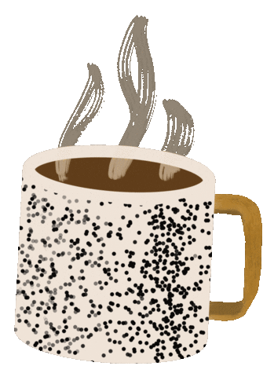

# 💫 Welcome to my profile:
<table width="100%" cellspacing="5" style="border: none;">
    <tr>
        <!-- rows -->
        <td>👩🏼‍💻 I'm currently working on Kotlin project 💻 I'm looking for an internship</td>
        <td style="text-align: right;">
            
        </td>
    </tr>
</table>

# 💻 Tech Stack:
   
# 📊 GitHub Stats:
 
 

## 🏆 GitHub Trophies

---

<picture>
  <source media="(prefers-color-scheme: dark)" srcset="https://raw.githubusercontent.com/evnikaSm/evnikaSm/output/github-snake-dark.svg" />
  <source media="(prefers-color-scheme: light)" srcset="https://raw.githubusercontent.com/evnikaSm/evnikaSm/output/github-snake.svg" />
  
</picture>